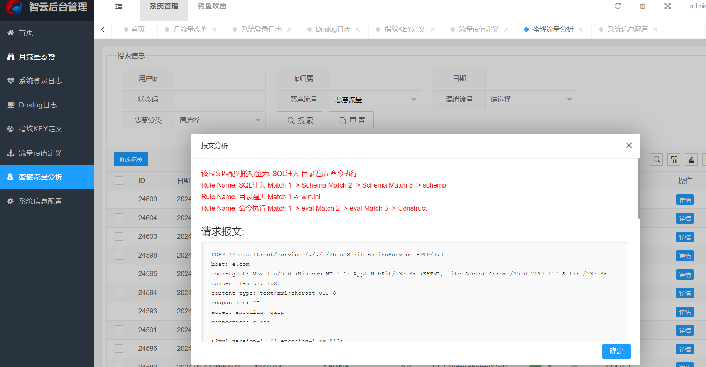
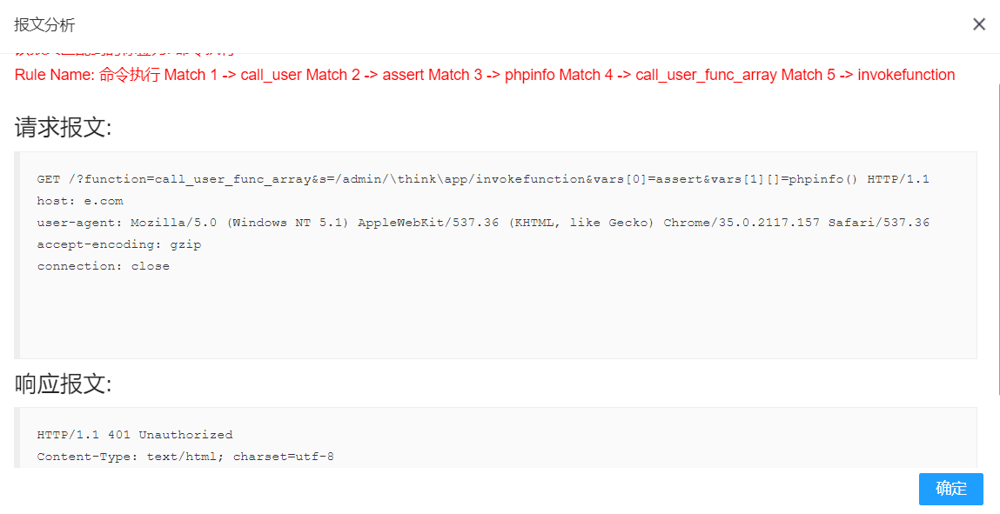

# 智云-一个抓取web流量的轻量级蜜罐

> 系统主要功能为抓取访问web的所有http流量,其他的功能就是围绕这http流量进行分析

## 后续待完善功能规划

* [X] 首页自定义指纹混淆扫描器(v1.1)
* [X] 自定义流量识别正则表达式(v1.3)
* [X] 系统后台路径自定义(v1.2)
* [ ] 首页jsonp功能实现
* [X] docker容器一键启动(v1.4)
* [ ] dns混淆优化
* [ ] 首页优化
* [ ] 漏洞添加自定义

# 系统演示

## 日流量态势

## 月流量态势

## 抓取流量效果

> 可以抓取到请求报文与响应报文

# 软件安装与使用

## 见 [/软件安装详情.md](https://github.com/xiaoxiaoranxxx/POT-ZHIYUN/blob/main/%E8%BD%AF%E4%BB%B6%E5%AE%89%E8%A3%85%E8%AF%A6%E6%83%85.md)

## 见 [/软件使用说明.md](https://github.com/xiaoxiaoranxxx/POT-ZHIYUN/blob/main/%E8%BD%AF%E4%BB%B6%E4%BD%BF%E7%94%A8%E8%AF%B4%E6%98%8E.md)
