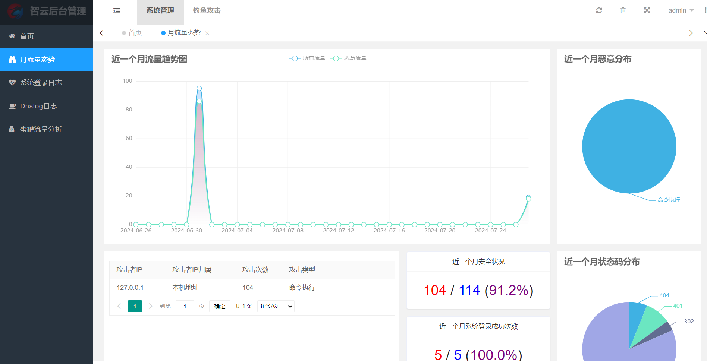
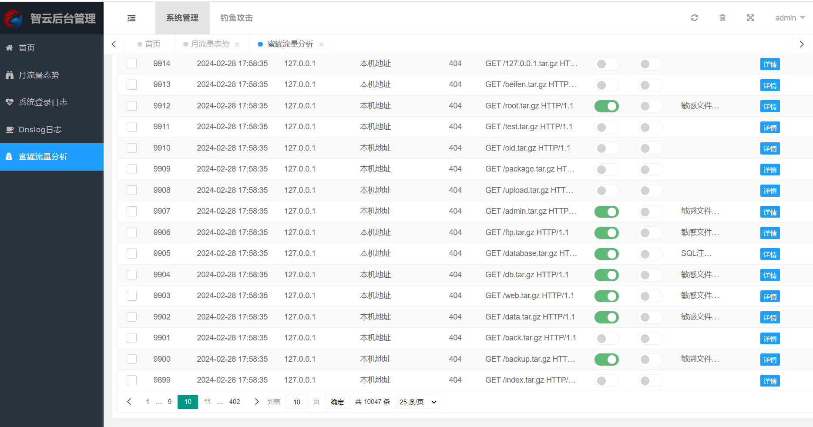
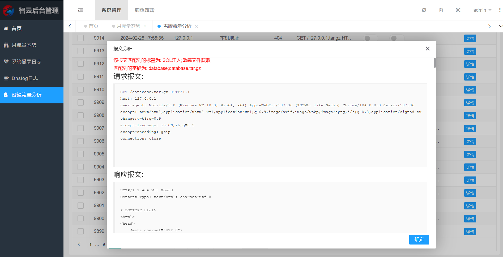
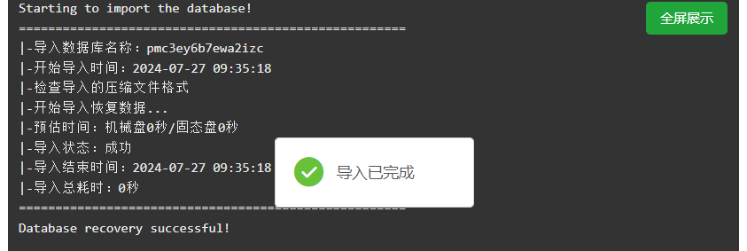
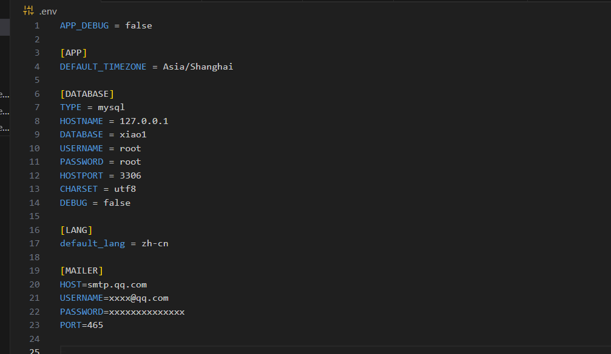
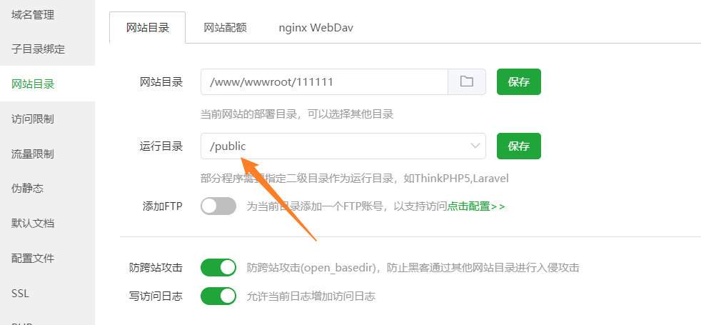

# 智云-一个抓取web流量的轻量级蜜罐

# 安装环境要求

apache + php7.4 + mysql8

# 系统介绍

# 宝塔搭建教程

- 创建数据库导入sql

  
- 修改.env 配置数据库密码和邮箱key

  
- 上传网站源码,配置/public为根目录

  
- 后台地址为http://127.0.0.1/xlogin/login  ,默认账号密码为admin/pot-admin

- 报错可以修改.env文件设置为APP_DEBUG为true进一步排查
