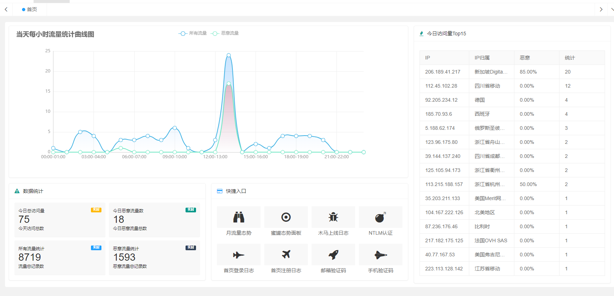
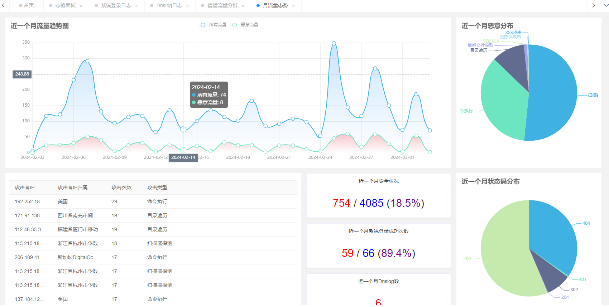
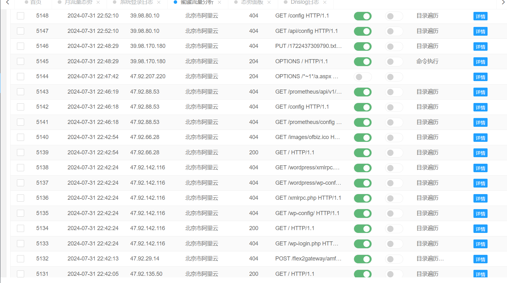
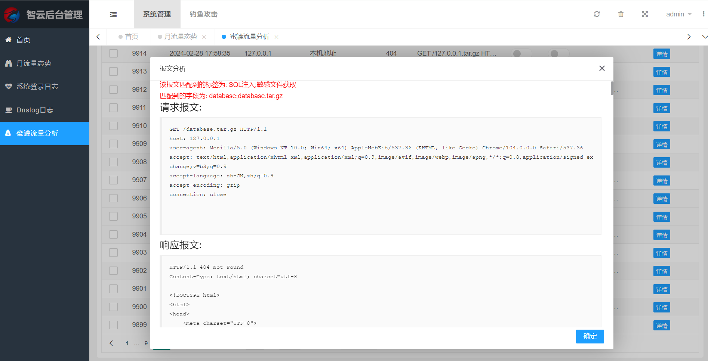

# 智云-一个抓取web流量的轻量级蜜罐

> 系统主要功能为抓取访问web的所有http流量,其他的功能就是围绕这http流量进行分析

## 后续待完善功能规划

* [X] 首页自定义指纹混淆扫描器(v1.1)
* [ ] 自定义流量识别正则表达式
* [ ] 系统后台路径自定义
* [ ] 首页jsonp功能实现
* [ ] docker容器一键启动

# 系统演示

## 日流量态势

## 月流量态势

## 抓取流量效果

> 可以抓取到请求报文与响应报文

# 软件安装

见 /软件安装详情.md
