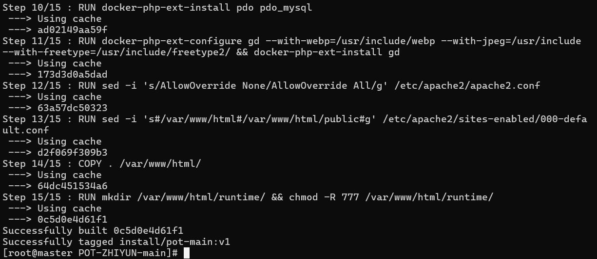
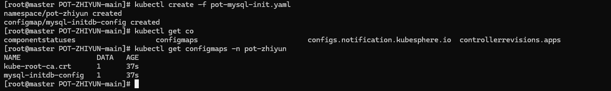
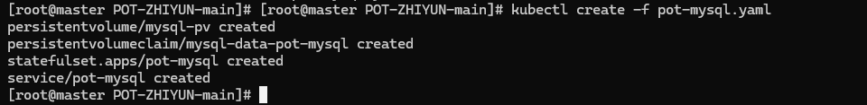
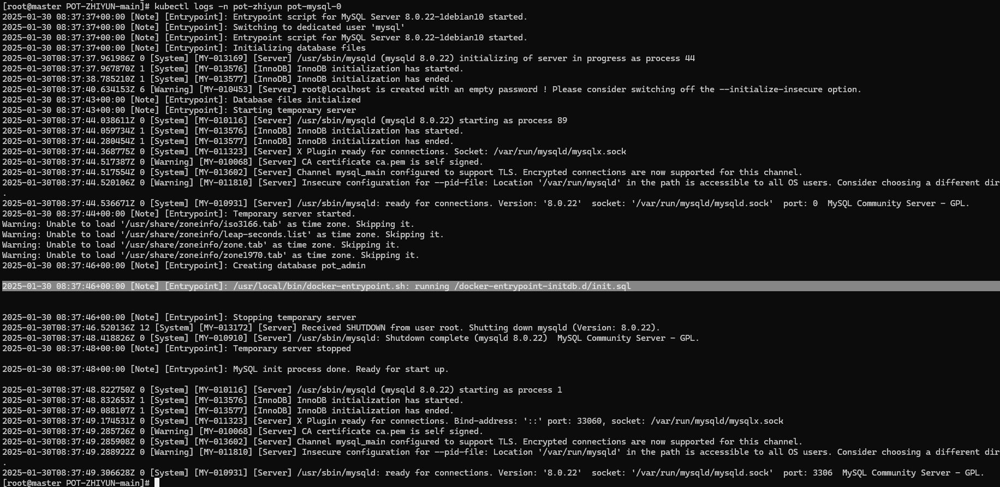
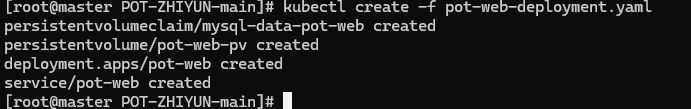
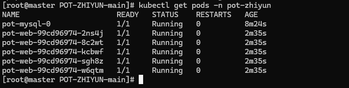
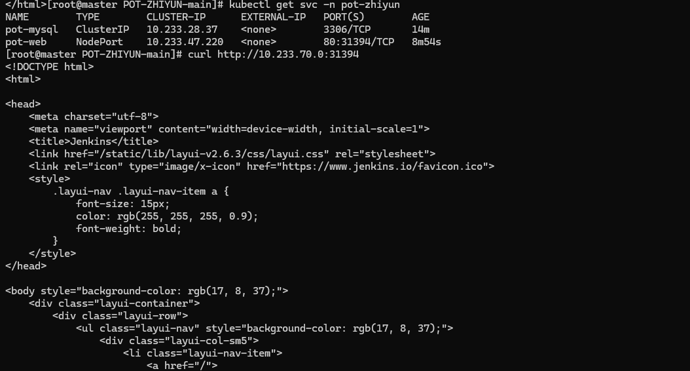
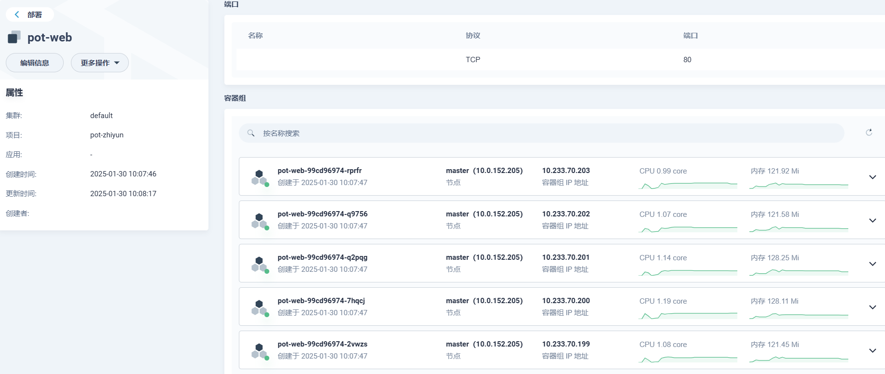

# k8s搭建教程

> 首先下载代码文件

```
git clone https://github.com/xiaoxiaoranxxx/POT-ZHIYUN.git
cd POT-ZHIYUN
```

## 编译镜像

```
docker build -t install/pot-main:v1 .
```



## 创建命名空间和configmap

```
kubectl create -f pot-mysql-init.yaml

# 查看创建情况
kubectl get configmaps -n pot-zhiyun
```



## 创建pv,pvc,mysql

```
kubectl create -f pot-mysql.yaml
```



> 查看mysql容器中的init.sql是否成功初始化

```
kubectl logs -n pot-zhiyun pot-mysql-0
```



## 创建pv,pvc,web

```
kubectl create -f pot-web-deployment.yaml
```



# 确认正常安装

```
kubectl get pods -n pot-zhiyun
```

> pot-zhiyun空间下所有pod都为Running状态



```
kubectl get svc -n pot-zhiyun
```

> 查看svc的状态,pot-web 的NodePort出口端口为31394,因此访问http://127.0.0.1:31394/为200说明搭建成功



# 设计思路

## mysql

> mysql为StatefulSet类型,单数据库来存储
>
> 通过configMap来初始化数据库文件
>
> 通过pv卷来实现持久化存储,默认分配大小为10G
>
> 创建一个services,可通过pot-mysql来获取主机名

## web

> web为Deployment类型,可生成多个pod来实现负载
>
> 通过pv卷来实现runtime目录共享,达到多个pod数据同步问题
>
> pv卷默认分配大小为1G
>
> 创建一个services,可通过Local来获取真实IP地址
>
> NodePort会对外映射一个端口


> 面对多个扫描器同时扫描可达到负载效果,可以在内网多个节点配置蜜罐来达到内网多节点蜜罐


