# 智云-一个抓取web流量的轻量级蜜罐

> 系统主要功能为抓取访问web的所有http流量,其他的功能就是围绕这http流量进行分析

# 系统管理模块

## 首页

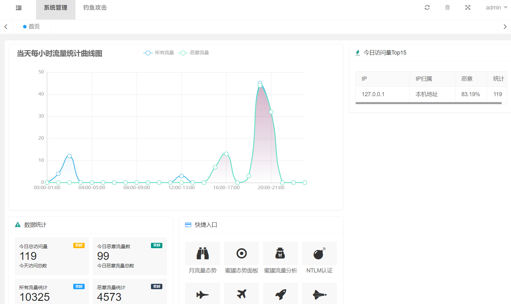

## 月流量态势

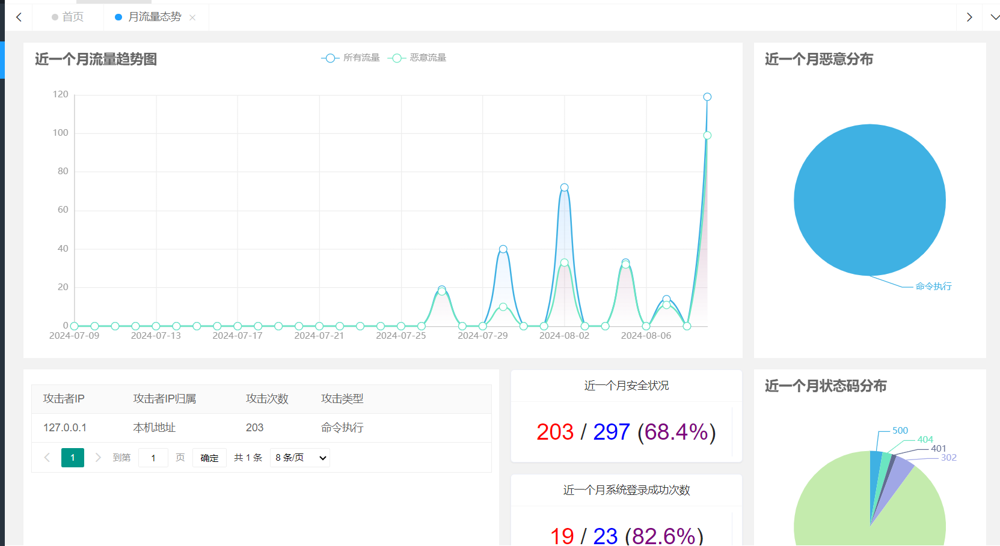

## 系统登录日志

- 记录每次登录的日志,便于做日志审计

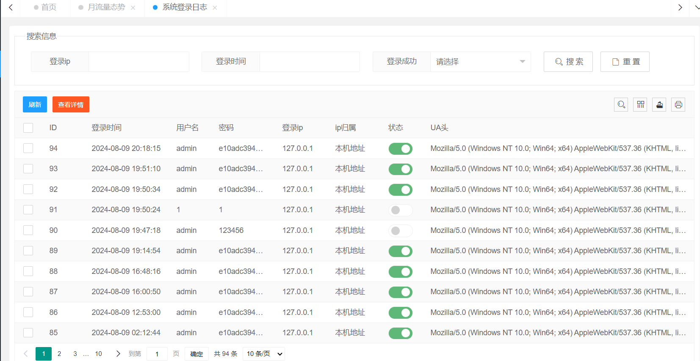

## Dnslog日志

- 很多高危漏洞需要用dnslog探测才能发现是否存在漏洞。如Fastjson,log4j等知验证漏洞，因此设计出混淆该dnslog探测的域名来迷惑攻击者
- 当攻击者使用带有的dnslog的域名来探测登录接口是否存在漏洞时,系统会使用gethostbyname函数来解析探测的域名并返回重定向到首页的报文,同时探测的域名会产生一个A记录,但并不会产生http请求
- 由于识别dnslog域名比较困难,因此实现为请求报文中全局抓取3级域名

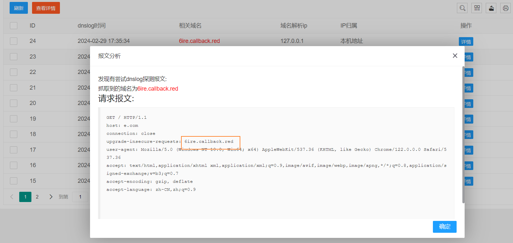

## 指纹KEY定义(v1.1+)

- 为了混淆扫描器的指纹识别功能,可以在首页添加些关键字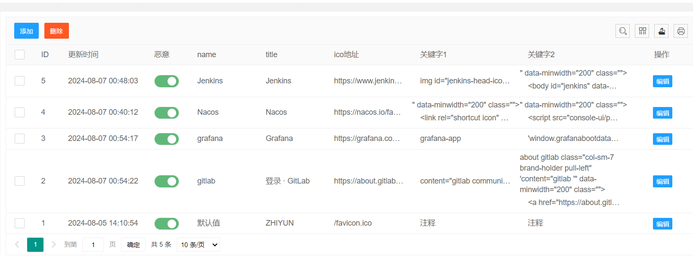
- 添加的指纹每次请求会随机抽取添加到首页的注释中

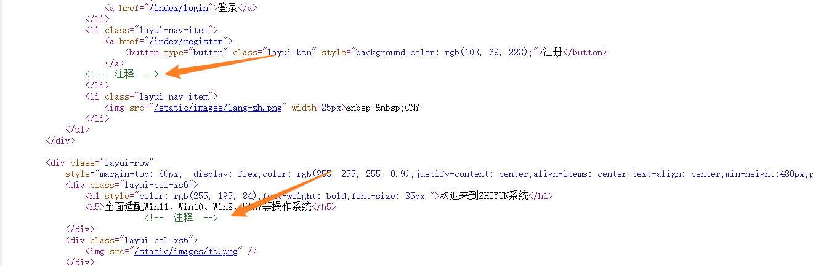

## 蜜罐流量分析

- 抓取的流量不会记录管理员的流量
  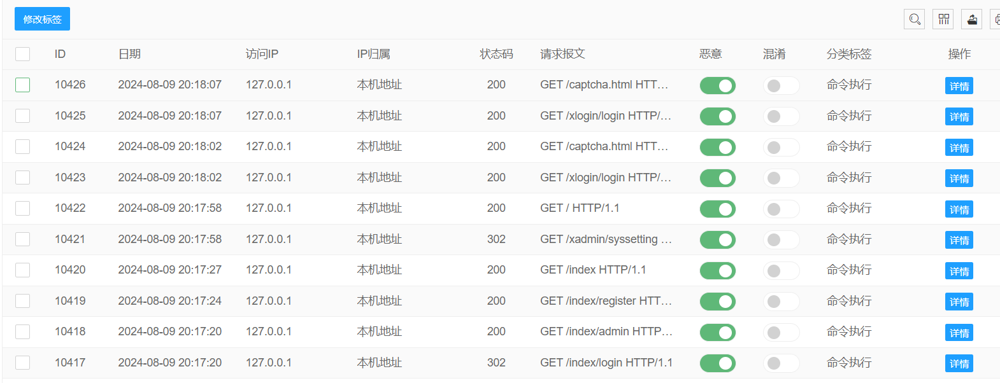

### 混淆流量

- dnslog的日志在这里会被标记为混淆
- sql注入个别情况混淆
- git-leak混淆
- hikvision-downfle-fileread标记混淆

>  混淆为并不是真的有漏洞,而是系统伪造的漏洞,例如:

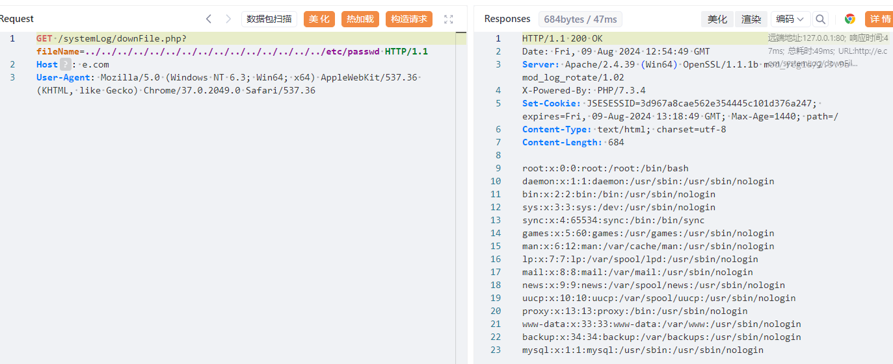

## 系统信息配置(v1.2+)

- 可以配置首页的一些信息
- 邮箱key可以在线修改

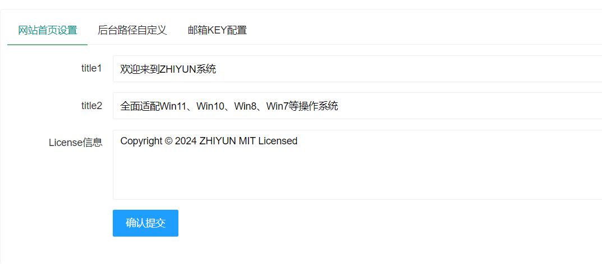

- 后台路径自定义

>  默认后台登录地址为http://127.0.0.1/xlogin/login
>
> 如果这里改为/xiao   那么后台的登录地址就为http://127.0.0.1/xiao  原来的那个路径就会失效

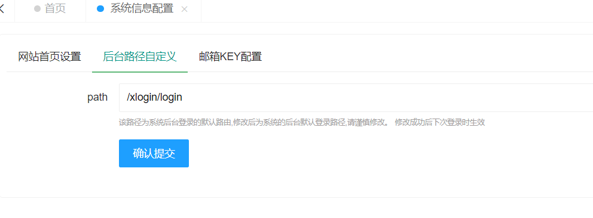

# 钓鱼攻击

## 态势面板

- 态势会显示首页所有抓取的记录

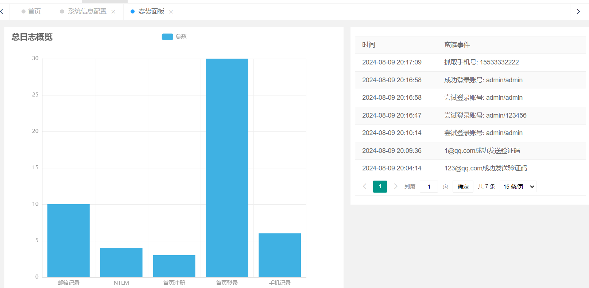
