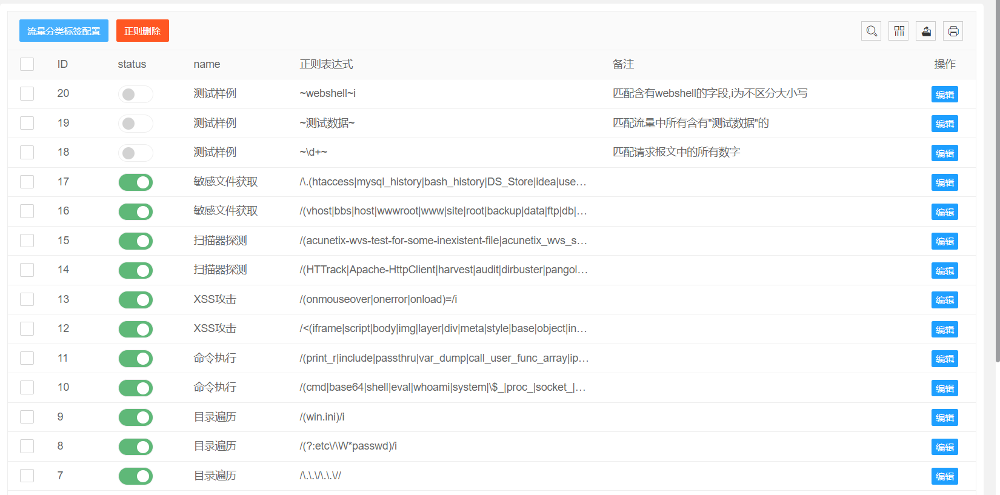
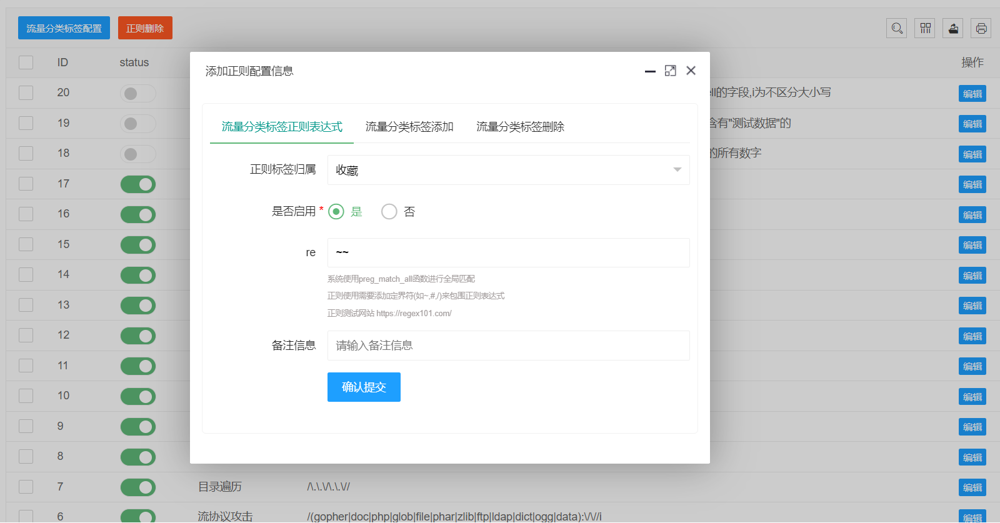
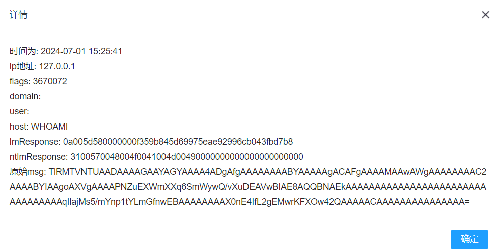

# 智云-一个抓取web流量的轻量级蜜罐

> 系统主要功能为抓取访问web的所有http流量,其他的功能就是围绕这http流量进行分析

---

# 系统管理模块

## 首页

## 月流量态势

## 系统登录日志

- 记录每次登录的日志,便于做日志审计

## Dnslog日志

- 很多高危漏洞需要用dnslog探测才能发现是否存在漏洞。如Fastjson,log4j等知验证漏洞，因此设计出混淆该dnslog探测的域名来迷惑攻击者
- 当攻击者使用带有的dnslog的域名来探测登录接口是否存在漏洞时,系统会使用gethostbyname函数来解析探测的域名并返回重定向到首页的报文,同时探测的域名会产生一个A记录,但并不会产生http请求
- 由于识别dnslog域名比较困难,因此实现为请求报文中全局抓取3级域名

## 指纹KEY定义(v1.1+)

- 为了混淆扫描器的指纹识别功能,可以在首页添加些关键字
- 添加的指纹每次请求会随机抽取添加到首页的注释中

## 流量re值自定义(v1.3+)

> 支持自定义添加正则表达式来为流量分类,系统使用preg_match_all函数进行全局匹配
> 正则使用需要添加定界符(如~,#,/)来包围正则表达式
> 正则在线测试网站 https://regex101.com/

## 蜜罐流量分析

- 抓取的流量不会记录管理员的流量
  

### 混淆流量自定义(v1.5+)

- dnslog的日志在这里会被标记为混淆
- 支持自定义添加漏洞相关响应内容

> 混淆为并不是真的有漏洞,而是系统伪造的漏洞,例如:

## 系统信息配置(v1.2+)

- 可以配置首页的一些信息
- 邮箱key可以在线修改

- 后台路径自定义

> 默认后台登录地址为http://127.0.0.1/xlogin/login
>
> 如果这里改为/xiao   那么后台的登录地址就为http://127.0.0.1/xiao  原来的那个路径就会失效

# 钓鱼攻击

> 蜜罐主要功能设计为抓取所有的http流量,以及混淆扫描器.对于攻击者来说,这种蜜罐做的确实很假
>
> 设计了一些功能,注册场景需要邮箱验证码,登录需要输入手机号,记录一下这些登录日志,其他的就没了,对于这些功能有些鸡肋
>
> 后续研究些漏洞利用的或许会有些好的效果.

## 态势面板

- 态势会显示首页所有抓取的记录

## ntlm认证

- WWW-Authenticate在认证的过程中会使用NTLM协议,在此过程中NTLM Type3消息会携带系统的主机名,因此可以通过伪造NTLM协议地址来抓取该信息,不过系统的主机名也不是什么敏感信息。

