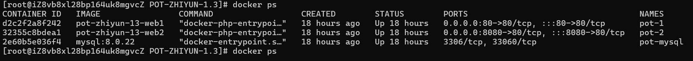
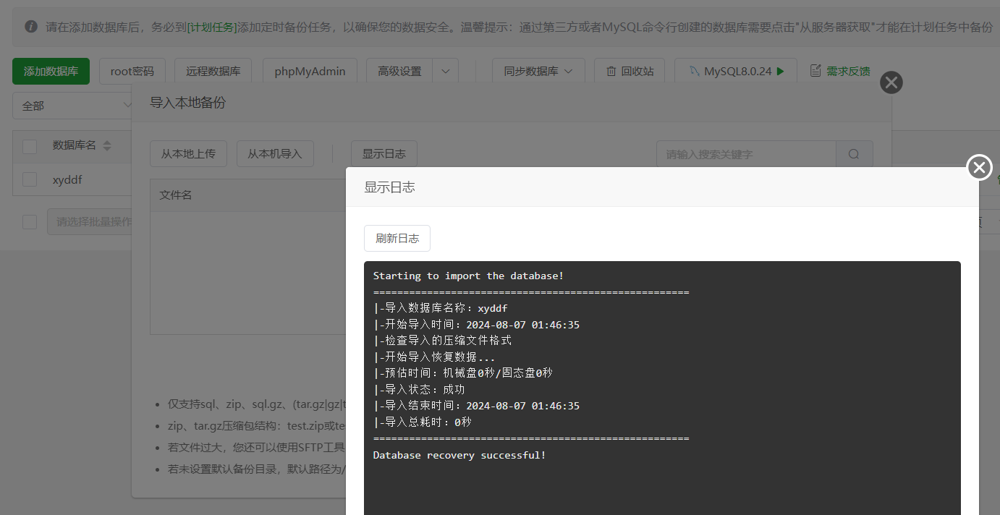
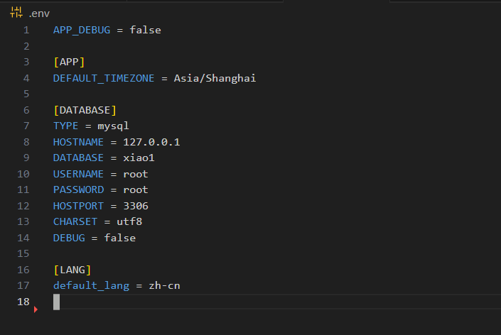
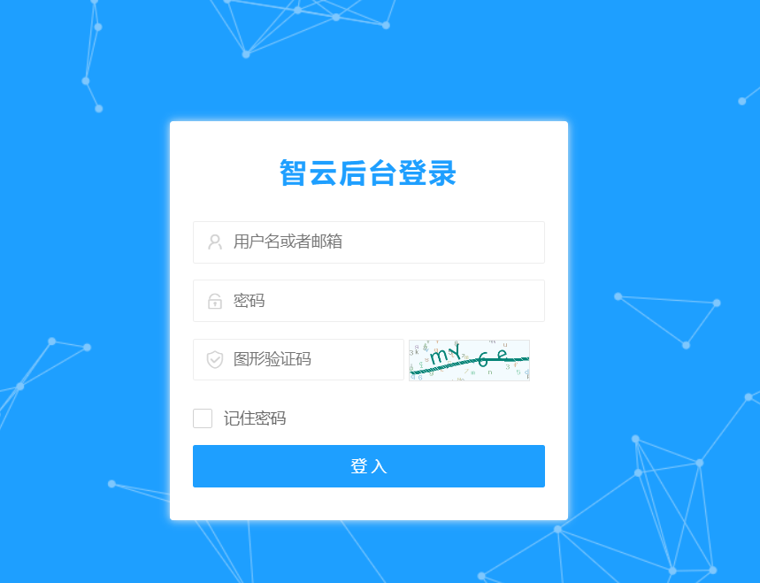
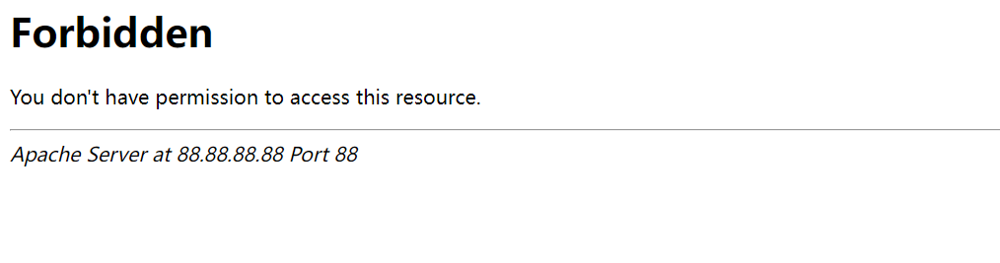
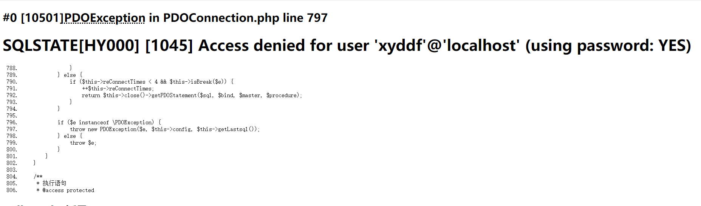

# 安装说明

## 关于环境

### apache

使用apache主要是为了实现404等请求重定向到首页从而更好的抓取流量,实现的位置在public/.htaccess

- 目前nginx我还不知到实现以下语法,因此目前还不支持nginx

```
<IfModule mod_rewrite.c>
  Options +FollowSymlinks -Multiviews
  RewriteEngine On

  RewriteCond %{REQUEST_FILENAME} !-d
  RewriteCond %{REQUEST_FILENAME} !-f
  RewriteRule ^(.*)$ index.php [L,E=PATH_INFO:$1]
  SetEnvIf Authorization .+ HTTP_AUTHORIZATION=$0
</IfModule>

```

### mysql8

- 由于使用的一些新的数据类型,因此需要使用MySQL8版本,不然sql插入时会报错

### php7.3.4+

- php必须php7.3.4+(php8不支持,可能会有错误)

## docker快速启动(v1.4)

```
git clone https://github.com/xiaoxiaoranxxx/POT-ZHIYUN.git
cd POT-ZHIYUN
docker-compose up -d
```



> 默认映射到80和8080端口
>
> mysql不对外开放,数据存储到主机/mysql-data/ ,在容器重置后数据不会被重置

```
http://1.1.1.1/xlogin/login
http://1.1.1.1:8080/xlogin/login
admin/pot-admin
```

>  两个网站同一个数据库,本质是一样的,只是多监测一个端口

## 宝塔快速安装教程

> 创建网站端口开放在80,8080抓取效果最佳

### 创建数据库并导入



### 修改.env 配置数据库密码和邮箱key

- 根目录下的.env文件
- 数据库密码注意输入正确



### 上传网站源码,配置/public为根目录

- 系统使用thinkphp6框架,启动目录在/public
- 修改配置会重置为/,记得该回来


## 默认后台地址

```
http://127.0.0.1/xlogin/login
默认账号密码为admin/pot-admin
登录后记得改密码!
```



# 报错情况举例

## 403 Forbidden

这种情况一般为未配置/public为运行目录



## 未知错误


### 这种需要修改.env文件开启debug查看

```
APP_DEBUG = true
调试好错误后记得关
```

- 常见报错为数据库未能正常链接


