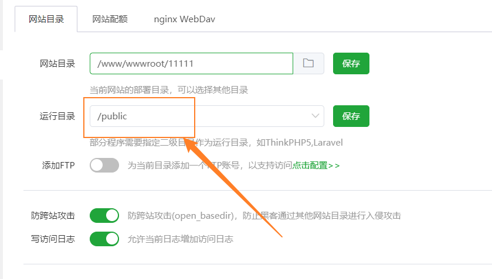

# 安装说明

## 关于环境

### apache

使用apache主要是为了实现404等请求重定向到首页从而更好的抓取流量,实现的位置在public/.htaccess

- 目前nginx我还不知到实现以下语法,因此目前还不支持nginx

```
<IfModule mod_rewrite.c>
  Options +FollowSymlinks -Multiviews
  RewriteEngine On

  RewriteCond %{REQUEST_FILENAME} !-d
  RewriteCond %{REQUEST_FILENAME} !-f
  RewriteRule ^(.*)$ index.php [L,E=PATH_INFO:$1]
  SetEnvIf Authorization .+ HTTP_AUTHORIZATION=$0
</IfModule>

```

### mysql

- 由于使用的一些新的数据类型,因此需要使用MySQL8版本,不然sql插入时会报错

### php

- php必须php7.3.4+

## 宝塔快速安装教程

>  创建网站端口开放在80,8080抓取效果最佳

### 创建数据库并导入


### 修改.env 配置数据库密码和邮箱key

- 根目录下的.env文件
- 数据库密码注意输入正确
- 邮箱key是实现前台邮箱注册发送验证码的功能(没有key只有该功能不可用,不影响系统使用)


### 上传网站源码,配置/public为根目录

- 系统使用thinkphp6框架,启动目录在/public
- 修改配置会重置为/,记得该回来



## 默认后台地址

```
http://127.0.0.1/xlogin/login
默认账号密码为admin/pot-admin
登录后记得改密码!
```


# 报错情况举例

## 403 Forbidden

这种情况一般为为配置/public为运行目录


## 未知错误


### 这种需要修改.env文件开启debug查看

```
APP_DEBUG = true
调试好错误后记得关
```

- 常见报错为数据库未能正常链接


